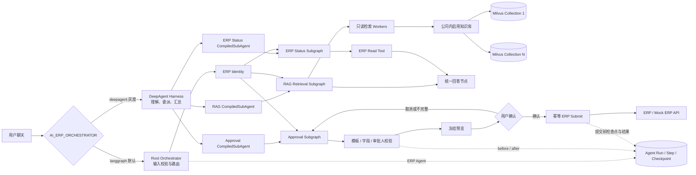

# Architecture

## 工作流边界

- Root Orchestrator 只负责身份前置、能力路由、统一回答和错误出口，不承载具体业务规则。
- `rag_retrieval`、`erp_status`、`approval` 是独立子图；现有 HTTP 根图继续通过共享
  `ErpRagState` 调用它们，接口契约不变。
- 工具适配层分别使用 `RagState`、`ErpStatusState` 和 `ApprovalState`。RAG 与 ERP 状态节点已经
  接入 State 工具；旧 `rag_tools.py`、`erp_tools.py` 入口继续保留，兼容既有路由和测试。
- 三个业务子图同时封装为 `rag-retrieval`、`erp-status`、`approval-workflow`
  `CompiledSubAgent`。子代理只返回有界证据或业务结果，不向父 Agent 返回认证上下文。
- `create_erp_agent_harness()` 提供 DeepAgent 装配入口。Harness 只做任务理解、领域委派和结果汇总，
  文件系统能力被拒绝；`/api/chat` 默认使用原 LangGraph Supervisor，配置
  `AI_ERP_ORCHESTRATOR=deepagent` 后按助手类型启用受限 Harness。
- LangGraph Studio 同时暴露 `erp_rag_assistant`、`rag_deepagent` 和
  `approval_deepagent`，便于分别检查原始根图、RAG Harness 与审批 Harness；Studio 工厂不附加
  进程内 Checkpointer，线程状态由本地 LangGraph API 管理。
- DeepAgents 新版可通过 `general_purpose_subagent` 参数关闭通用子代理；当前锁定的
  `deepagents==0.7.x` 尚未暴露该参数，因此按模型注册 `HarnessProfile` 达到相同效果。
  SDK 仍会装配 `read_file` 工具，但 `/**` 的读写权限均为拒绝，不能用于读取业务文件；
  `task` 工具只显示当前助手允许的领域 `CompiledSubAgent`。
- DeepAgent 模式复用原有内存或 MySQL 会话来源以及 Durable Execution。内存会话由
  Checkpointer 恢复消息，MySQL 会话从脱敏 `conversation` 恢复有界的 `user/assistant` 历史，
  避免重复注入。RAG 父 Agent 会把省略主语的追问改写为完整 `task.description`，RAG
  `CompiledSubAgent` 只将其作为检索 query，租户与 ACL 仍来自已验证 State。SSE 只释放已确认的最后一轮父 Agent 回答 Chunk；父 Agent 工具规划、Planner
  和子代理内部消息不会进入前端 Token 流，审批提示仍由确定性子图提供。
- RAG 子图可以并行运行多个只读检索 Worker，Worker 只能返回证据，不能写 ERP 或 MySQL 业务表。
- Approval 子图是确定性状态机：模板、字段、节点和审批人必须经过服务端校验，再生成带版本和哈希的冻结预览。
- ERP 写入只能从冻结预览的确认分支进入，并携带幂等键；任何字段修订都必须生成新预览并重新确认。
- `thread_id` 负责会话身份，`run_id` 负责单次请求执行生命周期；ERP Agent 节点通过
  `Run -> Step -> Checkpoint` 保存脱敏状态，失败或租约过期后由相同 `request_id` 恢复。
- ERP 写入采用“提交前检查点 + 稳定 Idempotency-Key + 提交结果检查点”。这提供至少一次调用和
  业务幂等语义；ERP 服务端必须真正实现 `Idempotency-Key`，才能覆盖网络超时后的未知结果窗口。
- 新的预算、余额或组织校验应作为审批子图中的只读 Worker 增加，不应让 LLM Worker 直接决定提交结果。

## 数据边界

- 本地 PDF：原始知识源，仅用于解析和追溯。
- JSONL：解析后的 Chunk、页码、版本和权限元数据，便于审查和重建索引。
- Milvus：按知识库保存 `text`、`dense` 以及检索过滤元数据；查询时合并公司内启用知识库的
  Collection，`sparse/BM25` 混合检索是后续扩展项。
- Assistant：保存自己的 Prompt、模型、检索默认参数和默认检索范围；范围可以是公司全部启用
  知识库，也可以在配置版本中保存一个或多个 `knowledge_base_key`。
- `retrieval_scope=selected` 时，配置版本必须保存至少一个知识库 Key；请求级范围只能收窄，
  不能把专用 Assistant 越权扩大到公司全库。
- KnowledgeDocument：`status=published` 且 `search_enabled=1` 的文件才进入公司级检索。
- ERP：用户、审批模板、实时审批状态和最终业务写入。
- LangGraph：跨 RAG 与 ERP Tool 的状态、路由和人工确认。
- MySQL Durable Execution：保存 ERP Agent 的运行租约、步骤结果和不可变检查点；不保存
  Authorization、Cookie、API Key 或刷新令牌。

## 安全边界

RAG 检索只按已验证的 `company_id`、`department`、知识库状态、文件状态和 `is_active` 做数据边界过滤。
请求体中的 `permission_tags` 不会直接作为权限依据，避免用户自行伪造标签造成越权；
待 ERP 返回已验证权限后，再将权限映射为 Milvus 过滤条件。ERP 提交携带幂等键，并通过应用日志和 `tool_calls` 保留审计证据。

State 工具只从服务端写入的 `user_context` 读取公司、部门和权限。审批提交工具只接受 State 中带
`preview_id`、版本、哈希和幂等键的冻结预览；模型不能通过工具参数覆盖公司、用户、Authorization
或提交载荷。DeepAgent Harness 中的原始 `authorization` 标记为私有 State，不会传给子代理。
