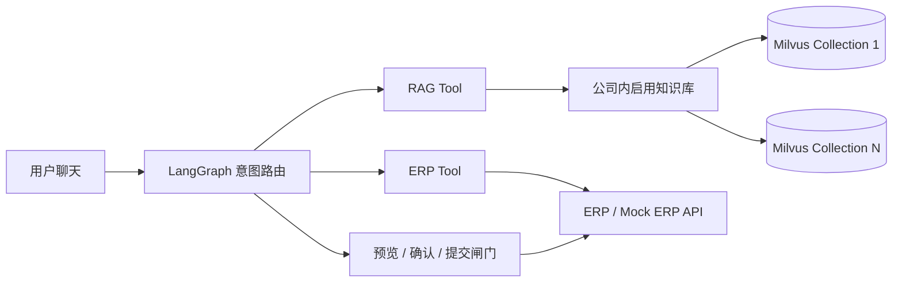

# Architecture

## 数据边界

- 本地 PDF：原始知识源，仅用于解析和追溯。
- JSONL：解析后的 Chunk、页码、版本和权限元数据，便于审查和重建索引。
- Milvus：按知识库保存 `text`、`dense` 以及检索过滤元数据；查询时合并公司内启用知识库的
  Collection，`sparse/BM25` 混合检索是后续扩展项。
- Assistant：保存自己的 Prompt、模型、检索默认参数和默认检索范围；范围可以是公司全部启用
  知识库，也可以在配置版本中保存一个或多个 `knowledge_base_key`。
- `retrieval_scope=selected` 时，配置版本必须保存至少一个知识库 Key；请求级范围只能收窄，
  不能把专用 Assistant 越权扩大到公司全库。
- KnowledgeDocument：`status=published` 且 `search_enabled=1` 的文件才进入公司级检索。
- ERP：用户、审批模板、实时审批状态和最终业务写入。
- LangGraph：跨 RAG 与 ERP Tool 的状态、路由和人工确认。

## 安全边界

RAG 检索只按已验证的 `company_id`、`department`、知识库状态、文件状态和 `is_active` 做数据边界过滤。
请求体中的 `permission_tags` 不会直接作为权限依据，避免用户自行伪造标签造成越权；
待 ERP 返回已验证权限后，再将权限映射为 Milvus 过滤条件。ERP 提交携带幂等键，并通过应用日志和 `tool_calls` 保留审计证据。
