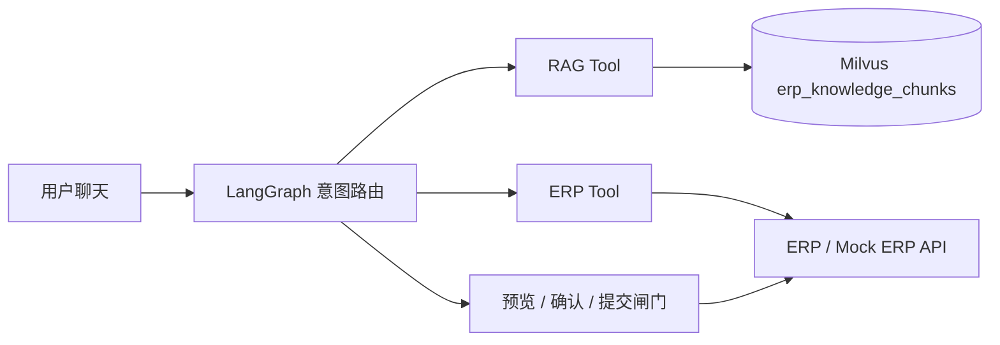

# Architecture

## 数据边界

- 本地 PDF：原始知识源，仅用于解析和追溯。
- JSONL：解析后的 Chunk、页码、版本和权限元数据，便于审查和重建索引。
- Milvus：`text`、`dense`、`sparse` 以及检索过滤元数据。
- ERP：用户、审批模板、实时审批状态和最终业务写入。
- LangGraph：跨 RAG 与 ERP Tool 的状态、路由和人工确认。

## 安全边界

权限过滤必须由 RAG 服务端强制注入，至少包含 `company_id`、`department`、`permission_tags` 和有效版本条件；不能只依赖 Prompt。ERP 提交必须带幂等键，并记录审计信息。
