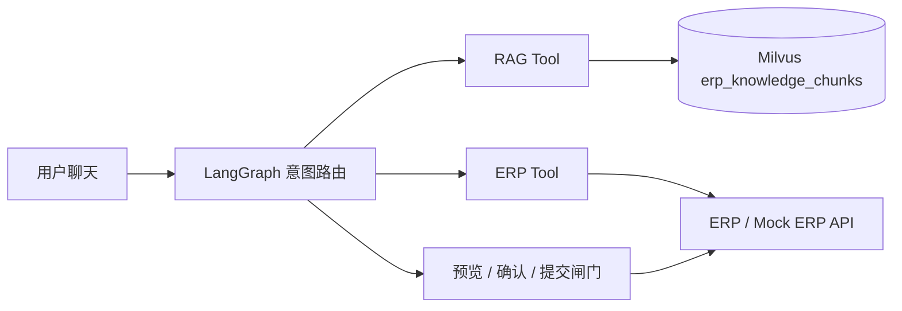

# Architecture

## 数据边界

- 本地 PDF：原始知识源，仅用于解析和追溯。
- JSONL：解析后的 Chunk、页码、版本和权限元数据，便于审查和重建索引。
- Milvus：当前存储 `text`、`dense` 以及检索过滤元数据；`sparse/BM25` 混合检索是后续扩展项。
- ERP：用户、审批模板、实时审批状态和最终业务写入。
- LangGraph：跨 RAG 与 ERP Tool 的状态、路由和人工确认。

## 安全边界

RAG 检索只按已验证的 `company_id`、`department` 和 `is_active` 做数据边界过滤。
请求体中的 `permission_tags` 不会直接作为权限依据，避免用户自行伪造标签造成越权；
待 ERP 返回已验证权限后，再将权限映射为 Milvus 过滤条件。ERP 提交携带幂等键，并通过应用日志和 `tool_calls` 保留审计证据。
