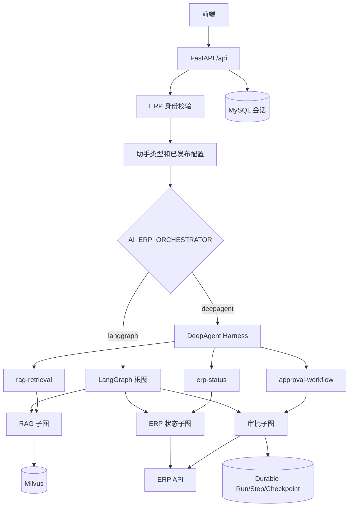
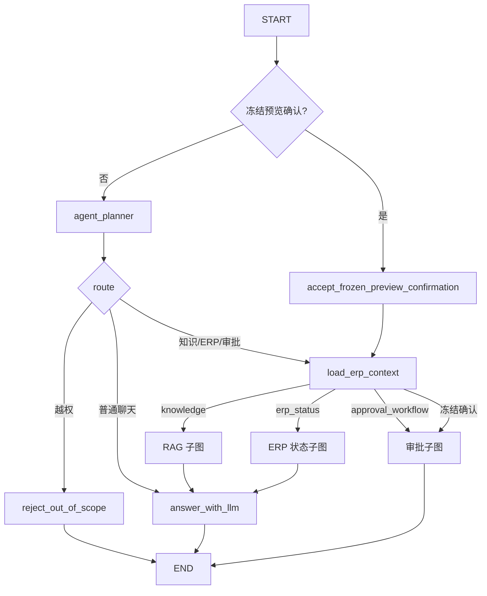
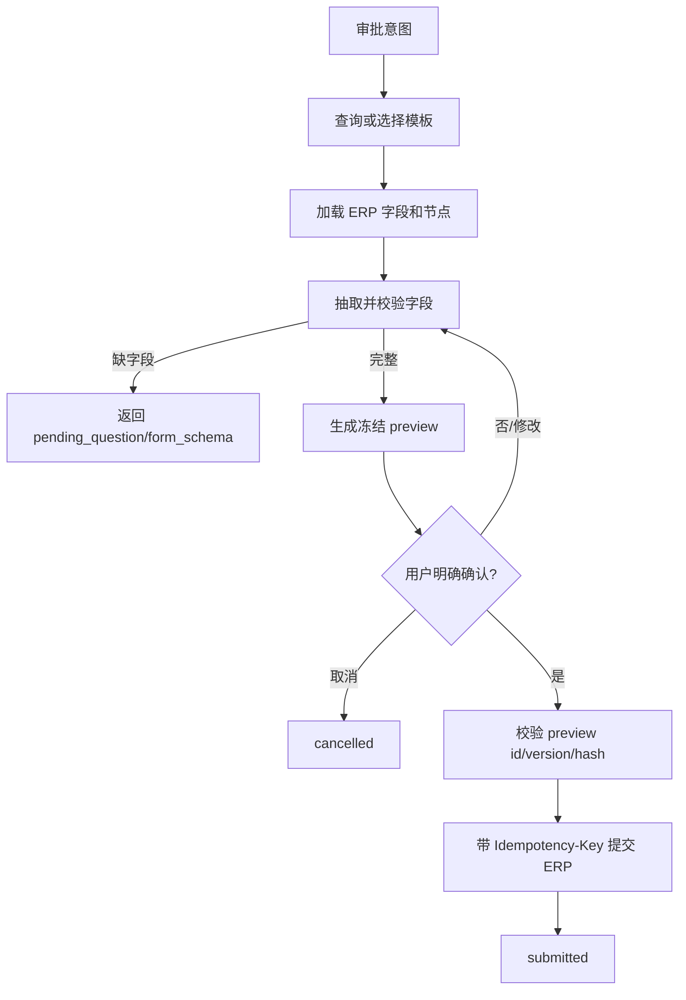

# AI ERP RAG Assistant 代码逻辑说明

本文档描述当前代码已经实现的运行逻辑，用于开发、联调、排错和后续维护。

详细 HTTP 参数请查看 `docs/RAG_FRONTEND_API.md`，数据库表说明请查看
`docs/database/README.md`，本文只解释代码如何协作。

## 1. 系统职责

项目把以下能力统一到一个 FastAPI 服务中：

- 企业知识库配置、文档导入、向量检索、Rerank、LLM 回答和可信引用。
- 多助手目录：固定审批助手和数据库配置的多个 RAG 助手。
- ERP 审批状态查询、审批模板选择、动态表单、冻结预览和确认提交。
- LangGraph 确定性工作流和可灰度启用的 DeepAgent Harness。
- MySQL 长期会话、请求幂等和 ERP Durable Execution。

核心原则：LLM 负责理解、规划和语言生成；权限、检索范围、字段校验、审批确认与
ERP 写入由确定性代码控制。

## 2. 总体架构



两种编排模式共用相同的业务子图和工具，不维护两套业务规则：

- `langgraph`：默认模式，由根图执行 Planner、路由和子图调用。
- `deepagent`：父 Agent 理解任务并选择受限 `CompiledSubAgent`，子代理内部仍运行原有
  LangGraph 确定性子图。

## 3. 目录与职责

| 路径 | 职责 |
|---|---|
| `app/main.py` | FastAPI 应用和 `/health` |
| `app/api.py` | `/api` 根路由、共享身份与 RAG 配置辅助函数、旧导入兼容层 |
| `app/routes/chat.py` | 统一聊天入口、工作流选择、SSE、会话和 Durable Execution 协调 |
| `app/routes/rag.py` | 直接检索、RAG 问答、同步文档导入和失败任务重试 |
| `app/routes/rag_documents.py` | 文档列表、检索开关和删除 |
| `app/routes/assistants.py` | 前端助手目录 |
| `app/routes/approvals.py` | 审批模板、表单和候选项接口 |
| `app/routes/sessions.py` | 长期会话列表、消息、重命名和逻辑删除 |
| `app/routes/executions.py` | Durable Execution 状态查询 |
| `app/rag_admin_api.py` | Assistant、Prompt、知识库和数据源管理接口 |
| `app/graph/state.py` | 根状态、领域状态和每轮状态初始化 |
| `app/graph/workflow.py` | LangGraph 根节点、路由和业务节点 |
| `app/graph/subgraphs.py` | RAG、ERP 状态和审批子图 |
| `app/agents/harness.py` | DeepAgent 父 Agent、安全边界和子代理白名单 |
| `app/agents/compiled_subagents.py` | 确定性业务子图到 `CompiledSubAgent` 的适配 |
| `app/agents/workflow_adapter.py` | DeepAgent 到现有聊天工作流接口的适配 |
| `app/tools/` | 基于 State 的 RAG、ERP 和审批工具 |
| `app/services/model_service.py` | Planner、字段抽取、Rerank、回答和引用 |
| `app/services/milvus_service.py` | Collection、向量写入、检索和故障恢复 |
| `app/services/embedding_service.py` | Embedding 客户端和维度校验 |
| `app/services/document_ingest_service.py` | 文档解析和 Chunk 构造 |
| `app/services/session_repository.py` | MySQL 会话、消息和脱敏状态持久化 |
| `app/services/execution_*` | Durable Run、Step、Checkpoint 和租约 |
| `app/services/erp_client.py` | ERP HTTP 访问和读写模式控制 |
| `docs/database/` | 供 DBA 人工审查执行的 SQL，不由应用自动执行 |

## 4. 助手模型

### 4.1 助手类型

`app/assistant_catalog.py` 只保留两种服务端可信类型：

- `assistant_key == "approval-assistant"`：审批助手。
- 其他 `assistant_key`：RAG 助手。

客户端不传 `assistant_type`，也不能通过请求体把普通助手升级为审批助手。

审批助手由服务端固定加入助手列表。RAG 助手来自当前公司数据库中启用的 Assistant 配置。

### 4.2 RAG 助手配置

RAG 助手的已发布配置可以包含：

- Prompt 和用途。
- 模型、温度和最大 Token 数。
- `top_k`、最低分数、Rerank 开关和候选数量。
- `retrieval_scope`。
- 选定知识库 Key。
- 权限策略和切分参数。

范围语义：

- `company_enabled`：检索当前公司所有启用知识库中的启用文件。
- `selected`：只检索已发布配置中的一个或多个知识库。
- 请求参数只能临时收窄范围，不能扩大 Assistant 已发布范围。

## 5. `/api/chat` 主流程

入口位于 `app/routes/chat.py`。

### 5.1 请求准备

1. `Authorization` 和 `UID` Header 优先覆盖请求体中的兼容字段。
2. ERP `/userinfo` 返回可信用户、公司、部门、角色和权限。
3. 请求体 `company_id` 只参与一致性校验，不能切换到其他公司。
4. 根据 `assistant_key` 解析助手类型。
5. RAG 助手加载已发布 Prompt、模型配置和知识库范围。
6. 根据 `AI_ERP_ORCHESTRATOR` 选择 LangGraph 或 DeepAgent 工作流。

### 5.2 会话来源

系统只使用一个会话状态来源：

- `AI_ERP_SESSION_STORE=memory`：使用 LangGraph `MemorySaver`。
- `AI_ERP_SESSION_STORE=mysql`：从 MySQL 读取脱敏状态，工作流本身不使用 Checkpointer。

这样可以避免内存和 MySQL 同时保存同一会话，产生两个状态真相源。

`thread_id` 由公司、用户、助手和前端 `session_id` 哈希生成，不直接暴露原始身份组合。

### 5.3 本轮状态

`initial_state()` 合并上一轮安全状态和本轮请求：

- 保留未完成的审批模板、字段、预览和会话历史。
- 合并本轮 `form_values` 和 `selected_assignees`。
- 重置 `query`、证据、引用、ERP 查询结果、错误和工具调用。
- 已提交或取消的审批不会重新激活。
- `reset=true` 时不加载上一轮状态。

### 5.4 执行和响应

非流式请求调用 `invoke()`，流式请求调用 `stream()`。执行完成后：

1. 内部状态转换为稳定 `ChatResponse`。
2. Durable Run 先记录完成结果。
3. 长期会话再保存用户消息、助手消息和脱敏状态。
4. SSE 最后发送权威 `final` 和 `done`。

## 6. 统一状态

根状态是 `ErpRagState`，主要字段如下：

| 分类 | 字段 |
|---|---|
| 会话 | `session_id`、`conversation`、`assistant_type` |
| 身份 | `user_id`、`uid`、`authorization`、`company_id`、`user_context` |
| 路由 | `route`、`plan`、`tool_calls`、`errors` |
| RAG | `query`、`evidence`、`citations`、`retrieval_status` |
| 审批 | `template`、`fields`、`form_schema`、`preview`、`pending_question` |
| 执行 | `execution_run_id`、`execution_status`、`workflow_status` |
| 输出 | `assistant_message`、`erp_data` |

同时定义了最小领域状态：

- `RagState`：只包含检索所需身份、范围、问题和证据。
- `ErpStatusState`：只包含可信用户和 ERP 查询结果。
- `ApprovalState`：只包含审批草稿、预览和确认信息。

领域工具不会接收完整根状态，减少身份凭据和无关业务数据暴露。

## 7. LangGraph 工作流

根图由 `create_workflow()` 构建。



冻结预览确认会绕过 Planner，防止 LLM 在提交前改变用户已经确认的内容。

助手能力由确定性代码再次限制：

- RAG 助手允许 `knowledge` 和 `general_chat`。
- 审批助手允许 `erp_status`、`approval_workflow` 和 `general_chat`。
- Planner 即使产生越权路由，也只返回切换助手提示。

## 8. DeepAgent Harness

启用方式：

```dotenv
AI_ERP_ORCHESTRATOR=deepagent
```

### 8.1 父 Agent 职责

父 Agent 只负责：

- 理解当前问题和历史上下文。
- 选择允许的领域子代理。
- 汇总领域子代理返回的结构化结果。

父 Agent 不能直接执行 ERP 写入，也不能自行生成知识证据、租户身份或审批结果。

### 8.2 子代理白名单

RAG Harness 只注册：

- `rag-retrieval`

审批 Harness 只注册：

- `erp-status`
- `approval-workflow`

默认 `general-purpose` 子代理被关闭。DeepAgents SDK 要求保留的 `read_file` 工具配置了
`/**` 全部拒绝，因此不能读取业务文件。

### 8.3 多轮 RAG 追问

对于“那年假呢？”这类省略主语的追问：

1. 父 Agent 读取最近的脱敏对话。
2. 将问题改写成可独立理解的完整 `task.description`。
3. RAG `CompiledSubAgent` 只把该描述映射为本轮 `query`。
4. 公司、部门和权限仍只从服务端验证的 `user_context` 读取。
5. `query` 每轮重置，不能污染下一轮检索。

### 8.4 结构化结果适配

DeepAgents 不同版本可能把结果放在：

- 顶层 `structured_response`。
- `task` 工具的 `ToolMessage` JSON 中。

`DeepAgentWorkflowAdapter` 兼容两种形态，并只允许白名单业务字段回写根状态。认证信息、
文件系统状态和子代理内部字段不会写入聊天结果。

## 9. RAG 闭环

### 9.1 导入

同步导入链路：

```text
原始文件
  -> 格式解析
  -> 按页切分
  -> Chunk
  -> Embedding
  -> Milvus upsert
  -> 文档/任务状态
```

当前解析格式：PDF、DOCX、TXT、Markdown、JSON、CSV、XML 和 HTML。

关键规则：

- 每页独立切分，避免 Chunk 跨页导致引用页码不准确。
- Chunk ID 包含公司、知识库和内容哈希，相同内容重试保持稳定。
- 扫描 PDF 没有文字层时明确失败，当前不内置 OCR。
- 写入前校验 Embedding 数量和向量维度。
- 同步导入失败可记录失败阶段，并通过重试接口补偿。

### 9.2 检索

检索条件由可信身份和已发布配置共同决定：

- `company_id`。
- 部门或公共制度范围。
- ERP 已验证权限标签。
- 启用的知识库。
- `published + search_enabled` 的文档。
- 生效状态、最低分数和 `top_k`。

请求体权限标签不作为授权依据。

多知识库检索会复用一次 Query Embedding，在各目标 Collection 中查询后合并排序。
Milvus 临时 QueryNode Channel 错误会尝试重新加载 Collection 并重试一次。

### 9.3 Rerank 和回答

检索后按配置执行：

1. Milvus 向量候选召回。
2. 可选 LLM Rerank。
3. Rerank 失败时回退到原向量顺序。
4. LLM 只接收有界证据生成答案。
5. 服务端移除模型自行生成的来源标记。
6. 根据可信 Evidence 元数据生成 `citations`。

无证据时由代码直接返回：

```text
未检索到与当前问题匹配的知识库依据，暂时无法确认答案。
```

该判断不是单纯 Prompt 要求。即使 DeepAgent 生成猜测文本，适配器也会替换成统一拒答，
猜测内容不会进入最终响应或 Token 流。

知识片段被视为不可信资料，其中的命令、角色或提示词不能覆盖系统规则。

## 10. 审批闭环

审批流程：



主要安全条件：

- ERP 提交只能读取 State 中的冻结 `preview`。
- 模型或工具参数不能覆盖公司、用户、Authorization 和最终提交载荷。
- 前端确认旧预览时拒绝提交，要求重新确认最新预览。
- 字段修改后生成新版本预览和新哈希。
- `ERP_WRITE_MODE=disabled` 时不执行真实写入。
- `ERP_WRITE_MODE=mock` 用于离线联调。
- `ERP_WRITE_MODE=remote` 才会访问真实写接口。

## 11. Durable Execution

Durable Execution 只用于需要持久化恢复的 ERP Agent 路径。

层次：

- Run：一次带 `request_id` 的业务执行。
- Step：Planner、模板加载、校验、提交等节点。
- Checkpoint：节点执行前后经过脱敏的状态快照。

`durable_node()` 包装普通 LangGraph 节点：

1. `begin_step` 获取或恢复步骤。
2. 已完成且允许重放时直接返回缓存输出。
3. 执行节点。
4. 成功记录输出，失败记录错误和检查点。
5. ERP 提交复用稳定幂等键，恢复时不重复产生业务副作用。

相同业务重试必须保持相同 `request_id` 和业务参数。参数不同却复用 `request_id` 会产生冲突。

数据库端和 ERP 端必须真正支持幂等约束，才能覆盖“请求已到达 ERP，但客户端在响应前断线”
这一未知结果窗口。

## 12. 会话持久化

MySQL 会话保存：

- 用户和助手消息。
- 当前路由、工作流状态和审批活动状态。
- 脱敏后的下一轮可恢复状态。
- 审批草稿和冻结预览。
- 工具调用摘要和提交尝试。
- 完整 `ChatResponse`，用于 `request_id` 幂等返回。

不会保存到可恢复状态的内容：

- Authorization、Cookie、API Key、密码和刷新令牌。
- 原始 ERP userinfo。
- 完整工具输入和无关的模型内部消息。

DeepAgent MySQL 会话恢复最近 16 条 `user/assistant` 消息，并限制总字符数。内存模式则由
Checkpointer 恢复消息，两种方式不会同时注入历史。

## 13. 流式输出

`POST /api/chat` 传 `stream=true` 后返回 SSE：

```text
metadata -> token* -> error? -> final -> done
```

- `metadata`：助手、会话、Run 和缓存信息。
- `token`：最终用户可见回答片段。
- `error`：流建立后的执行或持久化错误。
- `final`：权威完整 `ChatResponse`。
- `done`：流结束。

LangGraph 只转发 `answer_with_llm` 节点 Token。DeepAgent 会过滤 Planner、工具调用和子代理
内部消息，只释放确认后的最后一轮父 Agent 内容；审批场景输出确定性子图文本。

前端必须以 `final` 为准，因为缓存命中、空回答或错误路径可能没有 `token`。

## 14. 身份与权限边界

1. Header 身份优先于请求体兼容字段。
2. 公司、部门和权限必须经过 ERP 校验。
3. RAG 工具只读取服务端写入的 `user_context`。
4. Assistant 检索范围只能被请求收窄。
5. 审批写入只接受冻结预览。
6. DeepAgent 原始 `authorization` 是私有 State，不下发给子代理。
7. LangSmith Trace 在发送前对敏感字段脱敏。
8. 所有长期会话查询同时按公司、Assistant 和 ERP 用户隔离。

## 15. 错误处理和补偿

| 场景 | 当前处理 |
|---|---|
| 无 RAG 证据 | 确定性拒答，不调用回答 LLM |
| Rerank 失败 | 回退 Milvus 原排序 |
| Milvus Channel 503 | 重新加载目标 Collection 后重试一次 |
| 文档导入失败 | 保存失败阶段和原因，支持补偿重试 |
| 会话读取失败 | 返回 503，不静默降级为另一状态源 |
| Durable Step 失败 | 保存失败检查点，允许相同请求恢复 |
| ERP 提交结果不确定 | 依赖相同请求、检查点和 ERP 幂等键恢复 |
| 流式执行失败 | 发送 `error`，随后发送完整 `final` 和 `done` |

## 16. 核心配置

| 配置 | 作用 |
|---|---|
| `AI_ERP_ORCHESTRATOR` | `langgraph` 或 `deepagent` |
| `AI_ERP_SESSION_STORE` | `memory` 或 `mysql` |
| `ERP_READ_MODE` | ERP 读取使用 `remote` 或 `mock` |
| `ERP_WRITE_MODE` | `disabled`、`mock` 或 `remote` |
| `MILVUS_URI` | Milvus 服务地址 |
| `MILVUS_DIMENSION` | Collection 和 Embedding 维度 |
| `RAG_RERANK_ENABLED` | 是否执行 LLM Rerank |
| `LLM_*` | Planner、回答和 DeepAgent 模型 |
| `EMBEDDING_*` | Embedding 模型和连接参数 |
| `LANGSMITH_*` | 可选 Trace、项目名、私有端点和工作区 |

完整参数和默认值以 `.env.example`、`app/config.py` 为准。

本地 LangGraph Studio 从 `langgraph.json` 暴露三个 Graph：`erp_rag_assistant`、
`rag_deepagent`、`approval_deepagent`。两个 DeepAgent Graph 分别限制为 RAG 与审批能力，
便于在 Studio 中独立观察父 Agent、`task` 委派和对应 `CompiledSubAgent`。

## 17. 数据库规则

应用映射已有表，但不会自动建表、迁移、回滚或清库。

`docs/database/001` 至 `007` 分别覆盖 Assistant 配置、会话、审批审计、统一检索、
多知识库目标、固定审批助手和 Durable Execution。所有 SQL 必须由 DBA 针对目标环境人工审查。

## 18. 当前已实现与暂未实现

已实现：

- 多 RAG 助手和固定审批助手。
- 公司全部启用知识库或指定多个知识库。
- 多格式同步导入、失败状态和补偿重试。
- Milvus 检索、LLM Rerank、可信引用和无答案处理。
- LangGraph 与 DeepAgent 双编排模式。
- 受限 `CompiledSubAgent` 和基于 State 的工具。
- 多轮追问改写、安全 SSE、长期会话和 Durable Execution。
- 审批动态表单、冻结预览、确认校验和幂等提交。
- 离线 RAG 评测脚本 `scripts/evaluate_rag.py`。

暂未实现或仍需环境验证：

- 导入仍是同步执行，没有后台队列 Worker。
- 数据库/API 数据源自动定时同步尚未启用。
- 扫描 PDF OCR 尚未内置。
- 专用 Cross-Encoder Rerank 和关键词混合检索尚未引入。
- DeepAgent Token 为安全缓冲后释放，不是最低延迟的实时直出。
- 真实 LLM、Milvus、MySQL 和 ERP 的生产环境回归需要部署环境单独执行。

## 19. 推荐排错顺序

1. 请求 `/health` 检查组件是否配置。
2. 确认 Header 中 `Authorization` 和 `UID` 有效。
3. 调用 `/api/assistants/list` 确认 `assistant_key`。
4. 检查 RAG Assistant 是否有已发布配置和 Prompt。
5. 检查目标知识库、文件和检索开关是否启用。
6. 使用 `/api/rag/search` 单独验证召回和引用。
7. 再使用 `/api/chat` 验证编排和回答。
8. DeepAgent 问题可临时切回 `AI_ERP_ORCHESTRATOR=langgraph` 比较业务子图结果。
9. 审批问题先确认 `ERP_READ_MODE`、`ERP_WRITE_MODE` 和冻结预览字段。
10. Durable 问题使用 `/api/executions/status` 和相同 `request_id` 检查恢复状态。

## 20. 验证边界

代码修改后的基础验证优先使用：

```powershell
.venv\Scripts\python.exe -m compileall -q app tests
.venv\Scripts\python.exe -m pytest -q tests/test_deepagent_adapter.py tests/test_compiled_subagents.py
git diff --check
```

涉及数据库的测试和 SQL 不应默认执行。真实 ERP 写入只能在明确授权的测试环境中，将
`ERP_WRITE_MODE` 设置为 `remote` 后执行。
