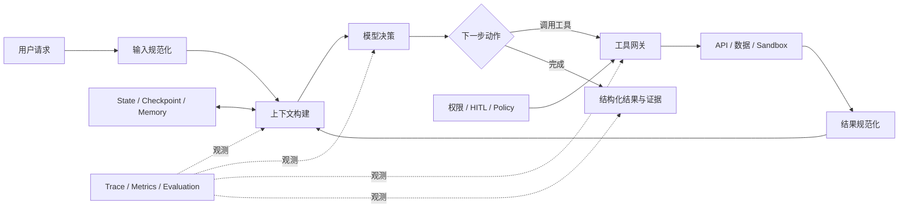

# Harness Engineering：从模型能力到可靠 Agent 系统

Harness Engineering 研究的不是“怎样写出一句更聪明的 Prompt”，而是：

> 怎样设计模型周围的运行环境，让一个概率性的模型能够稳定、安全、可观察、可恢复地完成真实任务。

这里的 **harness** 可以翻译成“驾驭层”“运行支架”或“工程外壳”。本文保留英文，是因为它强调的不只是框架代码，而是模型与真实世界之间整套可执行的约束和反馈系统。

## 1. Harness 是什么？

在传统软件测试中，test harness 会为被测程序准备驱动器、桩、测试数据和结果判定器。Agent Harness 的思路类似：模型不是独立工作的，它需要一套外部系统提供输入、工具、状态、反馈和安全边界。

一个实用的 Agent 系统可以拆成：

```text
Agent System
= Model
+ Instructions
+ Context
+ Tools
+ Execution Loop
+ State and Memory
+ Permissions and Sandbox
+ Checkpoint and Recovery
+ Tracing and Evaluation
+ Human Oversight
```

其中模型负责理解、推理和选择动作；Harness 决定模型能看到什么、能做什么、动作怎样执行、失败后怎么办，以及系统如何判断它真的完成了任务。

所以，Harness 不是一个单独的类，也不等同于某个 Agent 框架。LangGraph、Deep Agents、OpenAI Agents SDK 或自研系统都可以承载 Harness Engineering。

## 2. Harness Engineer 是什么？

“Harness Engineer”目前更像一种工程角色和工作重心，不是已经标准化的岗位名称。

它关注模型与确定性系统的边界：

- 把业务能力设计成模型容易正确调用的工具。
- 决定哪些上下文进入当前推理窗口。
- 设计状态、检查点、重试、超时和恢复机制。
- 为高风险动作设置权限、沙箱和人工审批。
- 保存执行轨迹并建立可重复的评测。
- 根据失败轨迹改进系统，而不只是继续加 Prompt。

它通常融合了后端工程、分布式系统、平台工程、安全工程、产品设计和 LLM 应用工程。核心能力不是“会调模型参数”，而是能把不确定的模型行为约束在可验证的系统里。

## 3. 为什么只有 Prompt 不够？

Prompt 可以表达意图，但不能单独提供工程保证。

例如，Prompt 可以写“不要重复提交采购单”，但真正的系统还需要：

- 提交接口接受幂等键。
- 重试前查询已有提交状态。
- 写操作前暂停并让用户确认。
- 权限层验证当前用户是否允许提交。
- 审计日志记录请求、审批和执行结果。

同样，Prompt 可以要求“只读取项目目录”，但如果工具实际提供不受限制的本地 shell，模型仍然具备读取主机密钥的能力。安全边界必须由工具、权限和隔离环境实施，不能依赖模型自律。

Harness Engineering 的基本判断是：

> Prompt 负责说明期望，系统机制负责保证边界。

## 4. 核心架构



这张图表达了三个重点：

1. 模型处在一个反馈循环中，不是一次性文本生成器。
2. 工具调用必须经过确定性的权限和执行层。
3. State、观测和评测横跨整个执行过程，而不是最后才补日志。

## 5. 九个核心思想

### 5.1 把模型当作概率性的决策者

模型可以规划和处理模糊问题，但它不应该成为权限系统、事务系统或事实数据库。

金额计算、状态机迁移、唯一性约束、权限判断和最终写入应该由确定性代码控制。模型负责解释意图和选择合法动作，后端负责验证并执行。

### 5.2 让正确路径容易，错误路径困难

不要只告诉模型“应该怎么做”，还要调整环境：

- 工具名称表达动作和边界。
- 参数 schema 排除非法组合。
- 工具只返回下一步需要的信息。
- 错误消息说明原因和可行修复方式。
- 危险工具默认不可见或需要审批。

这类设计常被称为 Agent-Computer Interface，也就是面向 Agent 的交互接口。

### 5.3 Context 是稀缺的工作内存

上下文不是越多越好。无关历史、大段原始日志和重复工具结果会稀释真正重要的信息。

一个好的 Harness 会区分：

- 当前轮必须看到的任务状态。
- 需要时才读取的文件和 Skills。
- 可以检索的长期记忆。
- 应该压缩的旧对话和大工具输出。
- 不应该进入模型的秘密、内部字段和无关数据。

目标不是“把所有信息塞给模型”，而是在每一步提供最小、充分、可信的上下文。

### 5.4 工具是契约，不是普通函数列表

工具质量往往比工具数量更重要。每个工具都应该有：

- 明确且互不重叠的职责。
- 可验证的输入 schema。
- 稳定、紧凑的结构化输出。
- 超时、错误分类和重试语义。
- 权限要求和副作用说明。
- 幂等性或去重机制。

如果模型频繁选错工具，首先检查工具的命名、描述、参数和返回值，不要立刻把更多规则堆进系统 Prompt。

### 5.5 把长任务外部化

长任务不能只依赖对话历史。计划、文件、阶段结果和未完成事项应该写入 State 或持久化存储。

这样可以：

- 在上下文压缩后继续工作。
- 在进程重启后恢复。
- 让人检查中间产物。
- 让子 Agent 通过明确的输入输出协作。
- 对每个阶段单独评测。

### 5.6 自主程度必须与风险匹配

不是所有动作都需要同样的自由度。

| 动作 | 建议控制方式 |
| --- | --- |
| 搜索、读取公开资料 | 可自动执行，保留日志 |
| 读取企业内部数据 | 身份校验、最小范围授权 |
| 生成草稿、模拟计算 | 可自动执行，标记为未提交 |
| 修改文件或业务状态 | 权限检查、版本控制、可回滚 |
| 提交审批、付款、删除数据 | 人工确认、幂等键、完整审计 |
| 执行不可信代码 | 隔离 sandbox、资源和网络限制 |

HITL 是风险控制的一部分，但不是万能安全层。它不能替代权限校验、租户隔离、事务和 sandbox。

### 5.7 失败是状态转换，不是意外文本

生产 Agent 必须把失败设计成明确路径：

- 超时后重试还是转人工？
- 参数无效时让模型修正还是直接拒绝？
- 工具部分成功时如何补偿？
- 远程任务失联后如何恢复？
- 达到最大步骤数后输出什么证据？

无限重试、“再想一遍”和吞掉异常都不是恢复策略。

### 5.8 用证据判断完成，而不是相信流畅回答

最终文本看起来合理，不代表任务真的完成。

完成条件应该尽可能程序化，例如：

- 必需工具是否被调用。
- 输出是否符合 schema。
- 引用的记录是否存在。
- 写入接口是否返回业务 ID。
- 风险项是否都有证据来源。
- 高风险动作是否经过批准。

评测也要同时检查最终结果和执行轨迹。

### 5.9 从简单系统开始，用失败证据增加能力

先建立最简单的可评测基线：一个 Prompt、少量工具和清晰结果。只有观察到具体失败后，再增加规划、记忆、子 Agent、动态 Skills 或复杂工作流。

复杂架构会增加新的失败面。多 Agent、长记忆和自动反思不是默认答案，而是针对已测量问题的工具。

## 6. 与其他 Engineering 的区别

这些概念互相重叠，不必强行划出绝对边界。下面的区分适合用于理解各自的主要关注点：

| 方向 | 主要问题 | 典型产物 |
| --- | --- | --- |
| Prompt Engineering | 怎样表达任务和约束？ | System Prompt、few-shot 示例 |
| Context Engineering | 当前这一步应该让模型看到什么？ | 检索、摘要、记忆和上下文组装策略 |
| Tool / ACI Engineering | 模型怎样可靠地作用于外部系统？ | 工具 schema、描述、错误和结果格式 |
| Workflow Engineering | 哪些步骤和分支应由代码固定？ | DAG、状态机、路由和补偿流程 |
| Agent Engineering | 如何构建完整 Agent 产品？ | 模型、工具、运行时和产品体验 |
| Harness Engineering | 如何让模型在长期运行中稳定、安全、可验证？ | 上下文、工具、状态、权限、恢复、观测和评测体系 |

Harness Engineering 可以看作 Agent Engineering 中专门处理“模型运行边界和闭环”的系统工程视角。

## 7. 常见失败如何映射到 Harness 改进

| 现象 | 常见根因 | 优先改进位置 |
| --- | --- | --- |
| 模型不知道关键事实 | 上下文缺失或检索失败 | Context builder、RAG、Skills |
| 选错工具 | 名称和职责重叠 | 工具描述、拆分或合并工具 |
| 参数经常错误 | schema 太宽或缺少业务约束 | 参数类型、枚举、服务端验证 |
| 工具结果被误读 | 返回值冗长或无结构 | 结构化结果、裁剪和证据字段 |
| 长任务忘记进度 | 状态只存在于聊天记录 | State、文件、checkpoint |
| 不断重复同一动作 | 缺少预算和停止条件 | 最大步骤数、去重、状态机 |
| 重试导致重复写入 | 写操作不幂等 | 幂等键、事务、执行状态查询 |
| 越权读取或执行 | 工具权限过大 | 权限网关、租户隔离、sandbox |
| 回答很好但任务没完成 | 只评最终文本 | 轨迹断言、结果校验器 |
| 更换模型后性能下降 | Harness 假设绑定旧模型 | 模型分层评测、Profile 和回归集 |

这张表体现了 Harness Engineering 的诊断方式：先根据轨迹定位系统层面的根因，再决定是否需要修改 Prompt。

## 8. Deep Agents 中的能力映射

Deep Agents 提供了一套预置 Harness，但仍需要业务系统补齐权限、事务和评测。

| Harness 层 | Deep Agents 能力 |
| --- | --- |
| 执行环境 | Tools、MCP、filesystem、backends、sandboxes |
| 上下文控制 | Summarization、文件卸载、prompt caching |
| 专业知识 | Skills、memory、retrieval |
| 任务分工 | `SubAgent`、`CompiledSubAgent`、`AsyncSubAgent` |
| 状态恢复 | LangGraph state、checkpointer、store |
| 人工控制 | `permissions`、`interrupt_on`、HITL |
| 运行观测 | Streaming、LangSmith trace |
| 模型适配 | Middleware、`HarnessProfile` |

需要特别区分：`HarnessProfile` 是 Deep Agents 中按模型调整 Prompt、工具可见性、middleware 和默认子 Agent 的 beta API；它只是 Harness Engineering 的一个配置面，不代表完整 Harness。

```python
from deepagents import (
    GeneralPurposeSubagentProfile,
    HarnessProfile,
    register_harness_profile,
)

register_harness_profile(
    "openai:gpt-5.4",
    HarnessProfile(
        system_prompt_suffix="输出前检查证据来源和未解决风险。",
        excluded_tools=frozenset({"execute"}),
        general_purpose_subagent=GeneralPurposeSubagentProfile(enabled=False),
    ),
)
```

`excluded_tools` 只控制模型是否看到工具，不是安全边界。真正的安全仍然要由工具实现、`permissions`、HITL、身份校验和隔离 backend 保证。

## 9. 采购审批案例

### 9.1 只有 Prompt 的版本

```text
请检查采购申请、预算、供应商和合规风险；如果没有问题就提交审批。
```

这个版本存在明显问题：模型可能遗漏检查、使用过期数据、重复提交，也无法证明每项结论来自哪里。

### 9.2 Harness 化后的版本

1. 输入层把自然语言解析成结构化申请，但金额和部门代码仍由后端校验。
2. 只读工具分别查询库存、供应商、预算和政策版本。
3. 合规规则由确定性代码计算，模型负责解释和补充开放性风险。
4. State 保存申请 ID、证据、风险、当前阶段和未完成项。
5. 复杂的供应商调查交给隔离上下文的 SubAgent。
6. 最终结论必须引用工具返回的证据 ID。
7. 提交工具在调用前触发 HITL，并再次检查用户权限和数据版本。
8. 提交接口使用幂等键，重试不会创建两张采购单。
9. Trace 保存每一步输入、工具调用、批准记录和业务结果。

这里提升可靠性的主要来源不是更长的 Prompt，而是把业务约束落实到了工具、状态、权限和验证器中。

## 10. Harness 的开发循环

### 第一步：定义任务契约

明确输入、允许动作、成功条件、风险等级和必须保留的证据。没有完成标准，就无法设计 Harness 或评测。

### 第二步：建立最小基线

先使用单 Agent、少量工具和确定性的结果校验。不要一开始就引入多 Agent 和长期记忆。

### 第三步：收集完整轨迹

保存模型请求、工具选择、参数、工具结果、状态变化、延迟和最终输出。对秘密和个人数据做脱敏。

### 第四步：给失败分类

区分模型推理问题、上下文问题、工具契约问题、运行时问题、权限问题和业务规则问题。

### 第五步：在最高杠杆点修复

如果十个调用方都会遇到同一参数错误，应修复工具 schema 或服务端验证，而不是在十段 Prompt 中重复提醒。

### 第六步：加入回归评测

把真实失败变成测试案例，同时验证答案和轨迹。至少包含成功、拒绝、超时、恢复、权限不足和重复请求。

### 第七步：分阶段发布

对新模型、新 Prompt、新工具版本和权限变化分别灰度，记录版本，保留回滚能力。

## 11. 评测 Harness 本身

Harness 的质量不能只用“回答准确率”衡量。

| 维度 | 示例指标 |
| --- | --- |
| 任务完成 | 成功率、必要证据覆盖率、结构化输出通过率 |
| 工具行为 | 工具选择准确率、参数有效率、重复调用率 |
| 效率 | Token、工具调用次数、端到端延迟、费用 |
| 可靠性 | 超时率、恢复成功率、幂等冲突率 |
| 安全性 | 越权阻断率、危险操作审批覆盖率、租户泄漏率 |
| 可观测性 | 失败是否可定位、关键步骤 trace 覆盖率 |
| 可运营性 | 版本可追溯率、回滚时间、告警有效率 |

离线评测适合稳定回归，在线观测适合发现真实分布中的新问题。两者都应该使用真实或脱敏后的代表性任务，而不是只测几个理想示例。

## 12. 常见反模式

### 超级 Prompt

把权限、业务规则、错误恢复和输出格式全部写进一个巨大 Prompt。规则难以验证，也容易随着上下文增长被忽略。

### 万能工具

一个工具接收任意 JSON 并能执行多种高风险动作。模型难以选择正确参数，权限也无法细分。

### 工具越多越好

一次暴露几十个相似工具会增加选择错误。应该按阶段、身份和任务动态暴露最小集合。

### 原始数据全部进入上下文

把数据库记录、日志和网页全文直接塞进 Prompt，导致成本增加、关键信号变弱和敏感数据暴露。

### 用无限重试代替恢复

没有错误分类、重试预算和幂等性，最终会放大故障或重复副作用。

### 把 HITL 当成安全系统

让人点击确认并不能阻止越权读取、提示注入或跨租户访问。人工确认必须建立在正确的权限和隔离基础上。

### 只看最终答案

一个流畅答案可能来自错误工具、过期证据或根本没有执行动作。没有轨迹评测就无法判断真实行为。

## 13. Harness Engineer 的典型产物

Harness Engineer 交付的不只是 Prompt，通常包括：

- 工具目录、参数 schema 和错误契约。
- Context 组装、摘要、检索和记忆策略。
- State schema、checkpoint 和恢复流程。
- 权限矩阵、审批点和 sandbox 策略。
- 超时、重试、幂等、补偿和任务预算。
- Trace 规范、指标、告警和调试界面。
- 离线评测集、轨迹断言和发布门槛。
- 模型、Prompt、工具和策略的版本记录。

因此，这个角色更接近“以模型为决策组件的系统工程师”，而不是只负责写提示词的人。

## 14. 一分钟总结

```text
Harness Engineering 是围绕模型构建运行环境的系统工程。

它不试图消除模型的不确定性，而是通过上下文、工具契约、状态、权限、
沙箱、恢复、观测和评测，把不确定性限制在可接受范围内。

Prompt 告诉模型应该做什么；Harness 决定它能看到什么、能做什么、
怎样知道做成了，以及做错后如何停止和恢复。
```

## 15. 延伸阅读

- [Anthropic：Building Effective Agents](https://www.anthropic.com/research/building-effective-agents)
- [LangChain：Deep Agents overview](https://docs.langchain.com/oss/python/deepagents/overview)
- [LangChain：Deep Agents customization](https://docs.langchain.com/oss/python/deepagents/customization)
- [Agent Skills specification](https://agentskills.io/specification)
